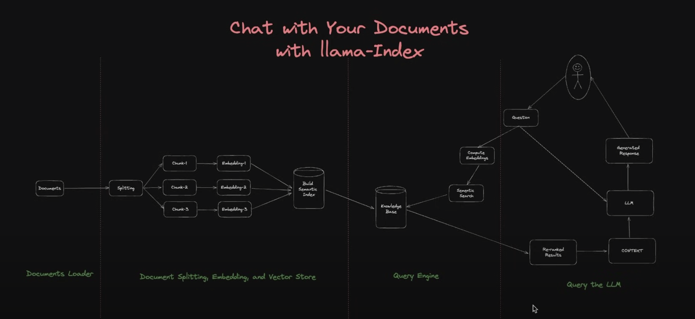

To download langchain documentation:
```bash
wget --no-check-certificate -r -A.html -P langchain-docs https://api.python.langchain.com/en/latest/api_reference.html
```

# [Reference](https://github.com/emarco177/documentation-helper/tree/main)

## [Documents Semantic Search with LlamaIndex](https://www.youtube.com/watch?v=WL7V9JUy2sE&list=PLVEEucA9MYhNrD8TBI5UqM6WHPUlVv89w)
This process contains four steps as follows:
1. Document Loader
2. Document splitting, embedding, and vector store
3. Query Engine
4. Query the LLM

